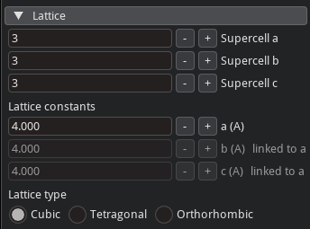
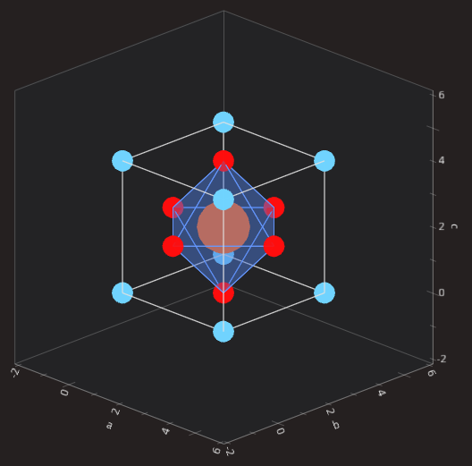
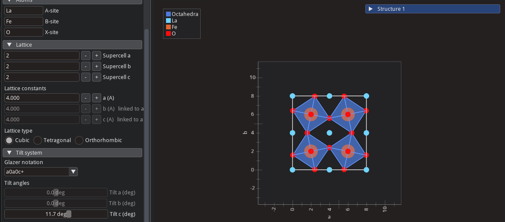
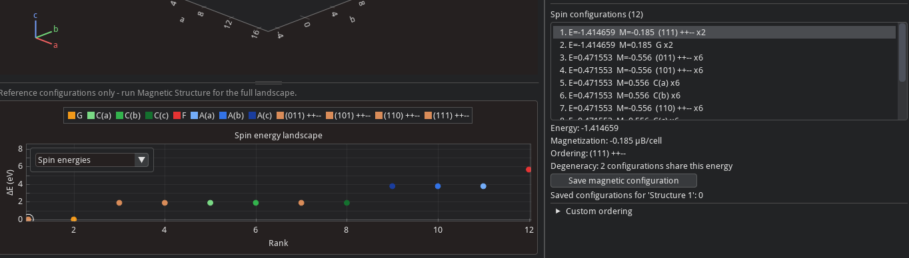
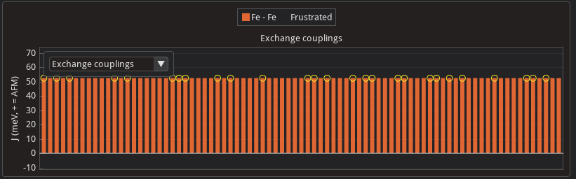
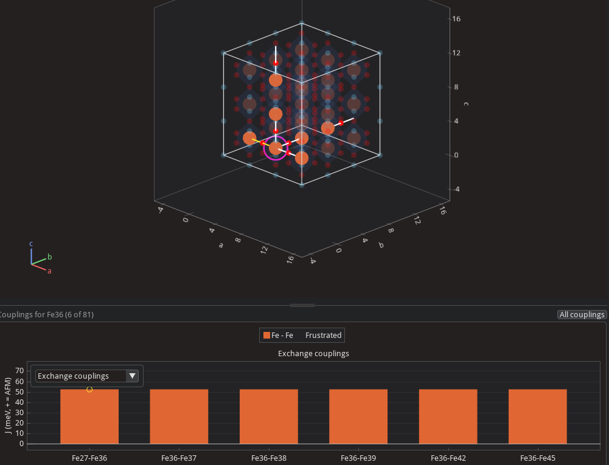

# User Interface
This tutorial can be followed via the [quick-mag web app](https://heindelj.github.io/quick-mag/app/) which can run in your browser.

## 3D Panel
In the center of the screen, you will see the default structure which is the $\mathrm{LaFeO_{3}}$ perovskite.

- Right click and drag to rotate the structure
- Double right click to go back to the starting view
- Scroll to zoom
- Click the small `a`, `b` and `c` buttons above the panel to look straight down that
  lattice vector. Click the same button again to turn the
  cell around and look at the opposite face.
- The `-5°` and `+5°` buttons turn the view in `5°` steps about an axis fixed in screen
  space, chosen with the `x` / `y` / `z` buttons on the second row.
- Click on entries in the legend to make them invisible
- Hover any atom to see what is, its assigned oxidation state, and assigned magnetic moment

## Builder Panel
In the top left is the builder panel which allows for creating various types of perovskites. In the formula dropdown menu, the available structure are $\mathrm{ABX_3}$, $\mathrm{A_2BB'X_6}$, $\mathrm{AA'_3B_4X_{12}}$, $\mathrm{AA'_3BB'X_{12}}$, and high-entropy perovskites.

### Atoms
Under the `Atoms` menu, you can change which atoms sit in each site of the perovskite structure. The available fields will change depending on which type of perovskite you have selected.

### Lattice

If you are not familiar with perovskite structures, it could be helpful to click on the `Lattice` dropdown menu and change the structure to a 1x1x1 cell. If you have selected single perovskite, then you will see a single cube.

This view should make it clear what an idealized perovskite structure is. We have a cube formed by the `A site` atoms, at the center of the cube is the `B site`, and the `X sites` are the faces of the cube. By default, octahedra are drawn connecting the X sites which tends to make it a little easier to understand the structure. (You might notice that this renders more atoms than are actually in the ABX3 unit cell. That option, which only affects visualization, can be toggled via a checkbox under `Rendering` called `Render Periodic Images`.)

You can also change the length of the lattice constants in the `Lattice` menu. There are three options `Cubic`, `Tetragonal`, and `Orthorhombic`. These control which lattice constants are allowed to change independently.

The structure is treated as a periodic material by default or as a cluster if you uncheck `Treat structure as periodic`.

### Tilt System
One unique structural feature of perovskites is that the octahedra often distort their orientation from the idealized structure. There are many so-called tilt systems which can be described via Glazer notation. This is easiest to understand visually.

- Make sure you have at least a 2x2x2 cell
- Select `a0a0c+` from the dropdown menu
- Orient the camera so that you are looking down the `c`-axis (pressing the `c` button at the top of the 3D panel will do this)
- Move the slider around for the tilt angle

Notice that the octahedra in each plane stacked along this axis stay aligned with one another. That is the meaning of `c+` in `a0a0c+`.

- Try changing the tilt system to `a0a0c-` and see what is different. What does `c-` mean?

### Defects

No material is perfect. Vancancies, substitution, and charge compensating protons can be included in structures from the `Defects and Impurities` menu.

## 2D Panel
Just beneath the 3D panel is the 2D panel which shows information about the predicted
magnetic properties of the material in question. There are two plots:

### Spin energies
 - Each point corresponds to a particular magnetic configuration
 - Configurations can be selected by clicking on the plot or from the scrollable box in the bottom right panel

### Exchange couplings
 - A second plot, which shows the computed exchange couplings, can be selected from the dropdown menu in the 2D plotting window
 - This bar chart shows all predicted exchange couplings between magnetic atoms

 - Clicking on a bar or on an atom in the 3D view shows the nonzero exchange couplings for that atom
 - Pairs of spins which are frustrated are highlighted with a yellow circle and connected by a yellow line in the 3D window
 - When the exchange couplings involving a particular atom are selected, an `All couplings` button appears in the top-right
 of the 2D pane appears and restores the original bar chart. Alternatively, you may click the relevant atom in the 3D view to deselect it.

 - While an atom is selected, only the atoms it interacts with magnetically can be selected
